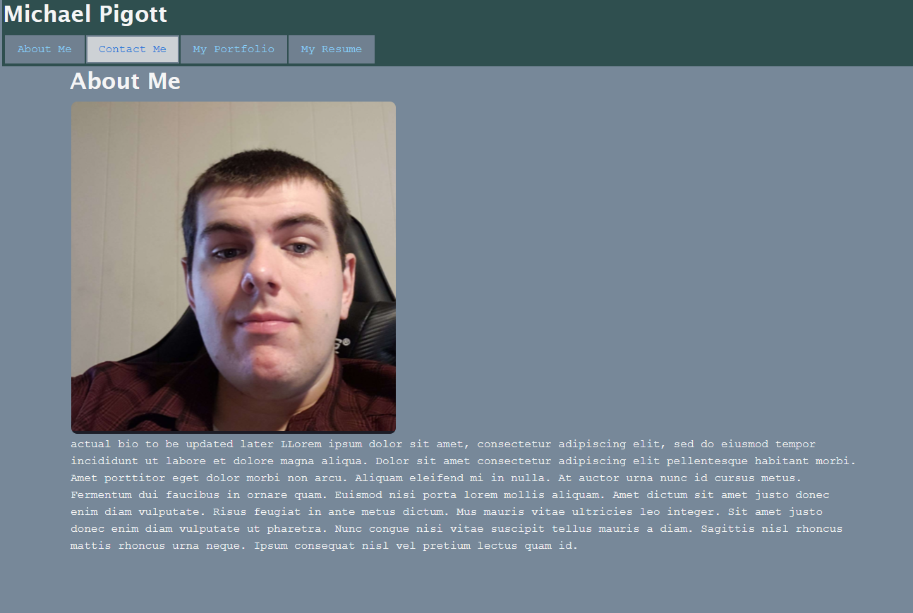
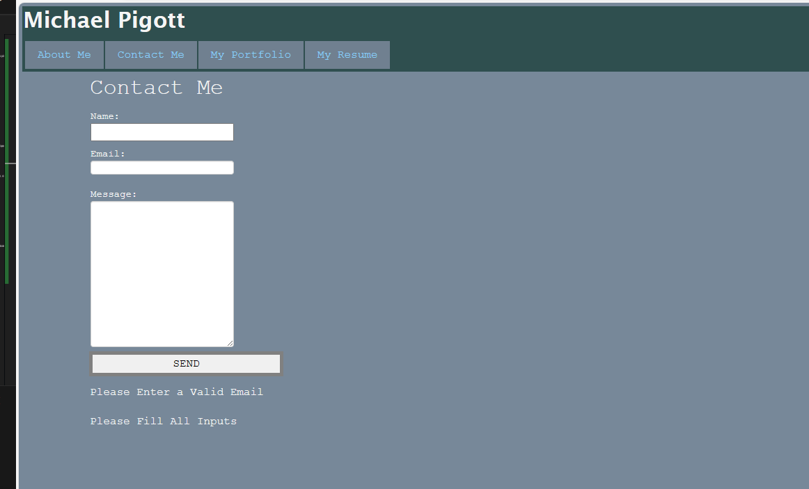
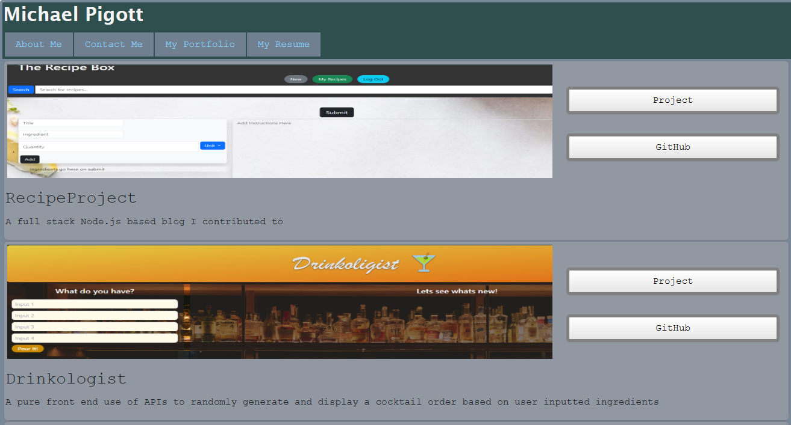
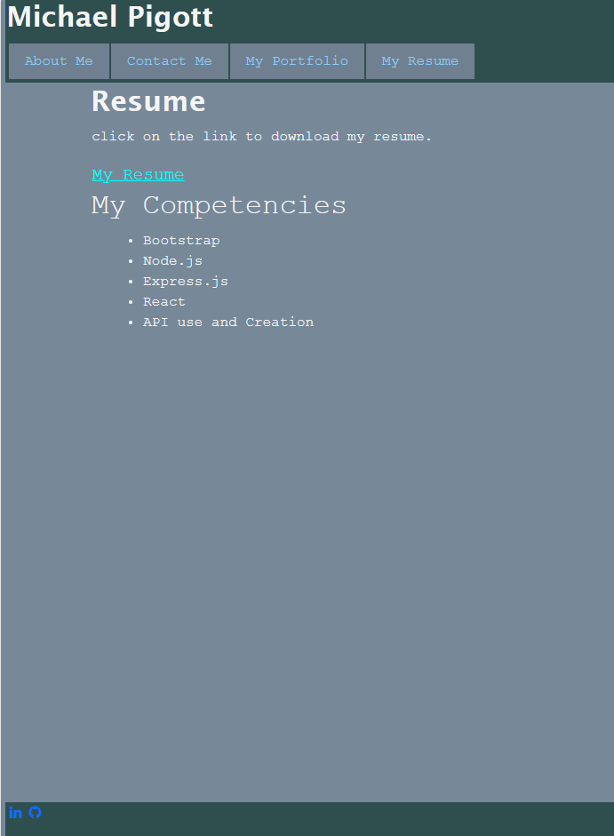

# reactportfolio

## Description
A multi page personal portfolio created for personal promotion and practice using React libraries.  Includes an 'about me' page including a bio and portrait, a 'contact me' page including a form to send information including name and email (actually sending message to a DB is currently relegated to future development)  form validates that feilds are filled and that email feild is filled with an email, and a 'My Resume' page including bullet points of competencies and a download link for resume.
## Table of Contents (Optional)

If your README is long, add a table of contents to make it easy for users to find what they need.

- [Installation](#installation)
- [Usage](#usage)
- [Credits](#credits)

## Installation
Open in browser.
Deployed at: 

## Usage

To add a screenshot, create an `assets/images` folder in your repository and upload your screenshot to it. Then, using the relative filepath, add it to your README using the following syntax:

 Image and bio provided, navigate site via navbar items with page names.

 
 Send information via entering name, email and message into labeled feilds.  Emails must be formatted as 'filler@xyz.etc' 
 and all feilds must be filled

 
 Read descriptions and see images of developed applications, buttons to side link to github Repos and deployed applications.

 
 Read bullet points of personal competencies, clicking link downloads resume.

## Credits

troubleshooting advice, making buttons open external tabs and duel state variable advice: https://chat.openai.com/

Adapted base code: edX bootcamp
##

